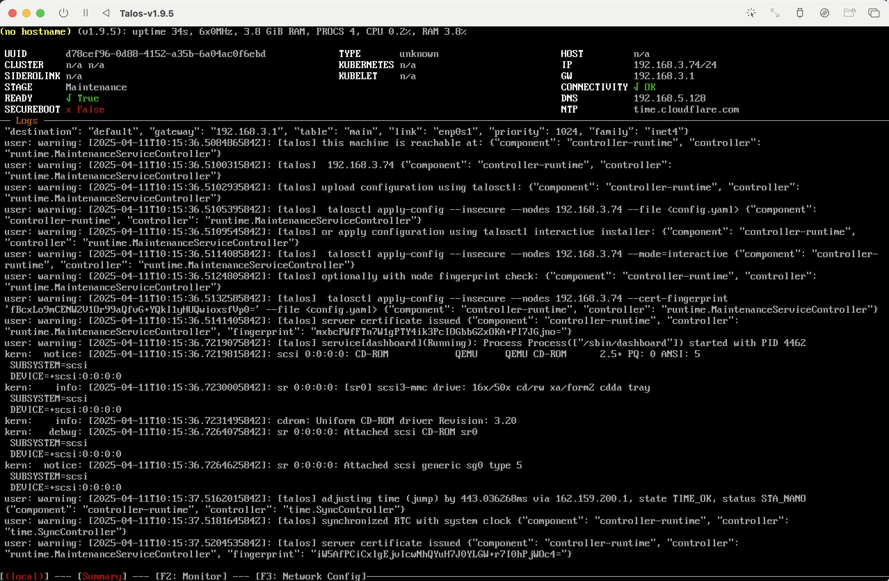
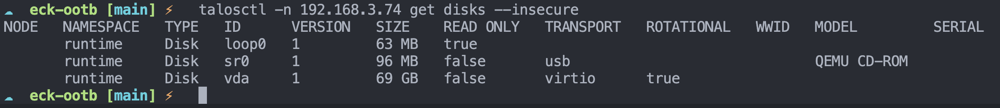
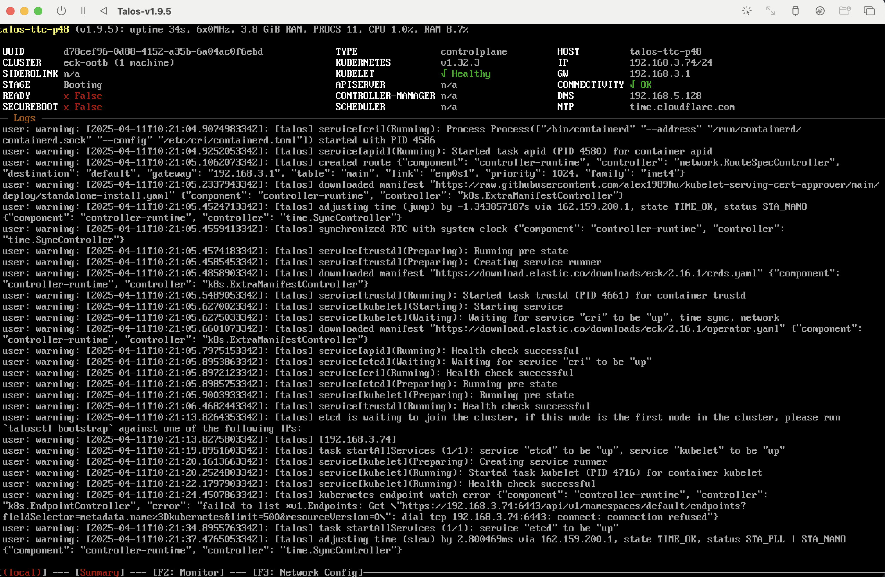
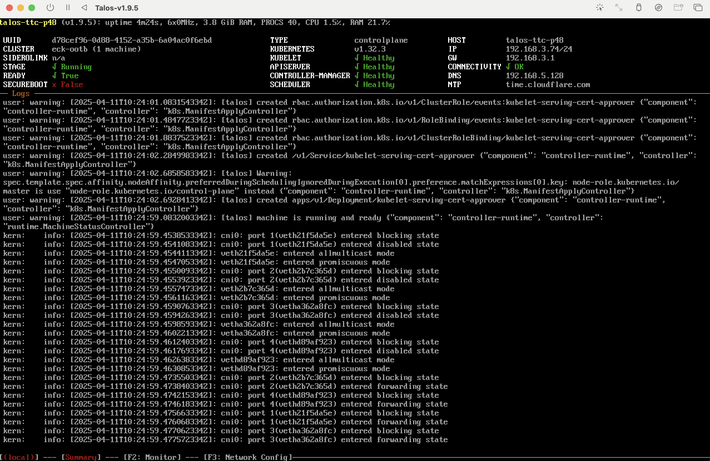
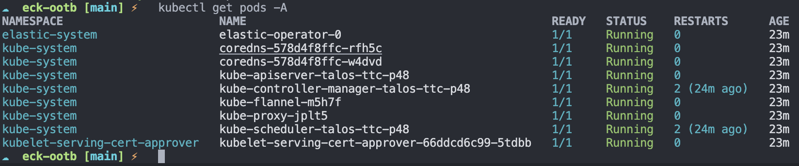

# Elastic Cloud Kubernetes Out of the Box

A fully packaged Elastic Cloud Kubernetes offering for getting started with Kubernetes and Elastic Cloud Kubernetes.  
This project is aimed at users with little to no experience with Kubernetes running on-premises. For cloud users, it is advised to use hyperscaler-native distributions of Kubernetes such as [EKS on AWS](https://aws.amazon.com/eks/), [GKE on GCP](https://cloud.google.com/kubernetes-engine?hl=en), and [AKS on Azure](https://azure.microsoft.com/en-us/products/kubernetes-service).

## Prerequisites

### Planning Your Deployment

#### Compute Requirements

Below are some recommended compute requirements for a successful Elastic Cloud Kubernetes Out of the Box deployment. Performance is heavily dependent on the infrastructure Elasticsearch will be running on, and the following should be adhered to as much as possible:

- Storage should be local to the server.
- Storage medium should be SSD, as Elasticsearch is an I/O-intensive service.
- When running on virtualisation platforms such as vSphere, resource contention should be managed to ensure the Talos Kubernetes virtual machine isn't waiting for CPU time.

| Deployment Size       | Node Count | RAM   | CPU    | Disk   | RAM:Disk Ratio | Total Storage Capacity |
| --------------------- | ---------- | ----- | ------ | ------ | -------------- | ---------------------- |
| Development           | 1          | 8GB   | 4 CPU  | 128GB  | 1:32           | 128GB                  |
| Small                 | 3          | 16GB  | 8 CPU  | 512GB  | 1:32           | 1536GB                 |
| Medium                | 3          | 64GB  | 12 CPU | 2048GB | 1:32           | 6144GB                 |
| Large (Control Plane) | 3          | 32GB  | 8 CPU  | 512GB  | n/a            | 1536GB                 |
| Large (Worker)        | 6          | 128GB | 16 CPU | 4096GB | 1:32           | 24576GB                |

1. The total storage figure is calculated by adding the total disk capacity of each Kubernetes node. **This isn't the total usable disk space.** Total usable disk space depends on how Elastic is deployed.

2. We recommend host machines that provide between 128 GB and 256 GB of memory. While smaller hosts might not pack larger Elasticsearch clusters and Kibana instances as efficiently, larger hosts might provide fewer CPU resources per GB of RAM on average. For example, running 64 \* 2GB nodes on a 128GB host with 16 vCPUs means that each node will get 2/128 of the total CPU time. This is 1/4 core on average, and might not be sufficient. We recommend inspecting both the expected number and size of the nodes you plan to run on your hosts to understand which hardware will work best in your environment.

#### Kubernetes Cluster

We use Talos as the Kubernetes distribution for this project because Talos is a pre-hardened, declarative operating system purely for running Kubernetes. This eliminates the need to manage a bloated underlying operating system and allows for easy configuration as code. Talos can be run as a single node for testing and development or as multiple nodes forming a cluster for production deployments or larger test and development use cases. Nodes can be added or removed after the initial deployment if necessary.

##### Single Node (Testing and Development)

##### Highly Available - Small

##### Highly Available - Large

#### Load Balancing

To access Elastic deployments running within the Kubernetes cluster, some form of load balancing is advised to avoid losing access in the event of a Kubernetes node going down.

## Requirements

- [Talosctl](https://www.talos.dev/v1.9/talos-guides/install/talosctl/)
- [Kubectl](https://kubernetes.io/docs/tasks/tools/)
- [JQ](https://jqlang.org/download/)

### Tested Versions

#### ECK-OOTB V1.0.0

- Talosctl v1.9.5
- Talos v1.9.5
- Cilium v1.7.2
- Kubectl v1.32.1
- JQ v1.7.1
- ECK v2.16.1

## Getting Started - Development

1. Download the relevant Talos ISO image for your platform.

   - X86: https://github.com/siderolabs/talos/releases/download/v1.9.5/metal-amd64.iso
   - ARM64: https://github.com/siderolabs/talos/releases/download/v1.9.5/metal-arm64.iso

2. Boot your machine from the ISO image downloaded earlier, either using a VM or on a bare-metal server. You will need DHCP enabled on the network your server is running on. It is advised to reserve the IP addresses used by Talos Kubernetes nodes.

Once booted, your machine should display a screen that looks like the following. This is the initial boot screen for an unconfigured and non-bootstrapped Talos node.

> **Info:** Take note of the IP address displayed in the top right-hand corner of the screen.



3. Update the `configuration` file in the root directory of this repository with the IP address from step 2. You can also set the name for your Kubernetes cluster here if you wish.

```sh
KUBERNETES_CLUSTER_NAME=eck-ootb
# This is the IP address you would like to use for the Kubernetes API server.
KUBERNETES_ENDPOINT=192.168.3.74
KUBERNETES_API_PORT=6443

TALOS_VERSION=v1.9.5

# development, production
DEPLOYMENT_TYPE=development
```

4. Update `talos/patches/configuration.patch.yaml` with the target install disk for your server, for example:

```yaml
machine:
  install:
    disk: /dev/vda
```

The available disks for your machine can be obtained by running

`talosctl -n <node ip> get disks --insecure`,

updating `<node ip>` with the IP address from earlier. The output will look something like this:



5. Generate the Talos Kubernetes configurations by running the script:

```sh
./scripts/generate-configurations.sh
```

This will create 3 files in the directory `talos/configurations`.

> **Important:** All of these files should be kept safe as they contain sensitive data that gives full access to the Talos Kubernetes cluster.

- `secrets.yaml`: A file containing all of the secrets required to create and operate a Kubernetes cluster.
- `talosconfig`: The admin context used to access the Talos Kubernetes cluster.
- `controlplane.yaml`: The machine configuration used for configuring Talos nodes.

6. Apply the configuration to the Talos node by running:

```sh
talosctl apply-config --insecure --nodes <node ip> --file talos/configurations/controlplane.yaml
```

Update `<node ip>` with the IP address from earlier. Running this command shouldn't produce an output. On the display of your node, you will see the stage change from `maintenance` to `booting` and a series of log messages, for example:



You may see logs suggesting services are failing. This is because we haven't bootstrapped the Kubernetes cluster yet, so services aren't able to start. Move on to the next step.

7. Bootstrap the Kubernetes cluster by running:

```sh
talosctl bootstrap --nodes <node ip> --endpoints <node ip> --talosconfig=talos/configurations/talosconfig
```

This command won't produce an output if successfully run. The bootstrap process may take a few minutes as it starts forming the Kubernetes cluster. Once complete, the display should show `Healthy` for Kubelet, APIServer, Controller-Manager, and Scheduler, and `Ready` should be `True`.



8. Create a Kubeconfig file by running:

```sh
./scripts/setup-kubectl.sh
```

The Kubeconfig file contains all required information for connecting and authenticating to the Kubernetes cluster.

Instruct Kubectl to use the Kubeconfig file by running:

```sh
export KUBECONFIG=talos/configurations/kubeconfig
```

Finally, test that Kubectl can access the cluster by running:

```sh
kubectl get pods -A
```

The output should look something like this:



9. Deploy an Elastic monitoring deployment by running:

```sh
kubectl apply -f elastic/monitoring-deployment/
```

> The monitoring deployment will be used for collecting and analysing monitoring information about Elastic deployments within the ECK installation.

## Deploy Elastic Clusters

Elastic clusters are deployed using Kubernetes manifests, which use the Elastic Cloud Kubernetes Custom Resource Definitions (CRDs) to provision and manage Elastic resources. The following Elastic resources can be managed by ECK:

- [Elasticsearch](https://www.elastic.co/docs/deploy-manage/deploy/cloud-on-k8s/elasticsearch-deployment-quickstart)
- [Kibana](https://www.elastic.co/docs/deploy-manage/deploy/cloud-on-k8s/kibana-configuration)
- [Agent](https://www.elastic.co/docs/deploy-manage/deploy/cloud-on-k8s/fleet-managed-elastic-agent)
- [Beats](https://www.elastic.co/docs/deploy-manage/deploy/cloud-on-k8s/beats)
- [Logstash](https://www.elastic.co/docs/deploy-manage/deploy/cloud-on-k8s/logstash)
- [APM Server](https://www.elastic.co/docs/deploy-manage/deploy/cloud-on-k8s/apm-server)
- [Maps Server](https://www.elastic.co/docs/deploy-manage/deploy/cloud-on-k8s/elastic-maps-server)
- [Enterprise Search](https://www.elastic.co/docs/deploy-manage/deploy/cloud-on-k8s/elasticsearch-deployment-quickstart)

Detailed documentation can be found on the Elastic website [here](https://www.elastic.co/docs/deploy-manage/deploy/cloud-on-k8s/manage-deployments).

An example manifest that deploys a 3-node Elasticsearch cluster with each node allocated 2GB of memory and 1 CPU:

```yaml
apiVersion: elasticsearch.k8s.elastic.co/v1
kind: Elasticsearch
metadata:
  name: monitoring-deployment
  namespace: monitoring
spec:
  version: 8.17.4
  nodeSets:
    - name: default
      count: 3
      config:
        node.store.allow_mmap: false
      podTemplate:
        spec:
          containers:
            - name: elasticsearch
              resources:
                requests:
                  memory: 2Gi
                  cpu: 1
                limits:
                  memory: 2Gi
                  cpu: 1
```
